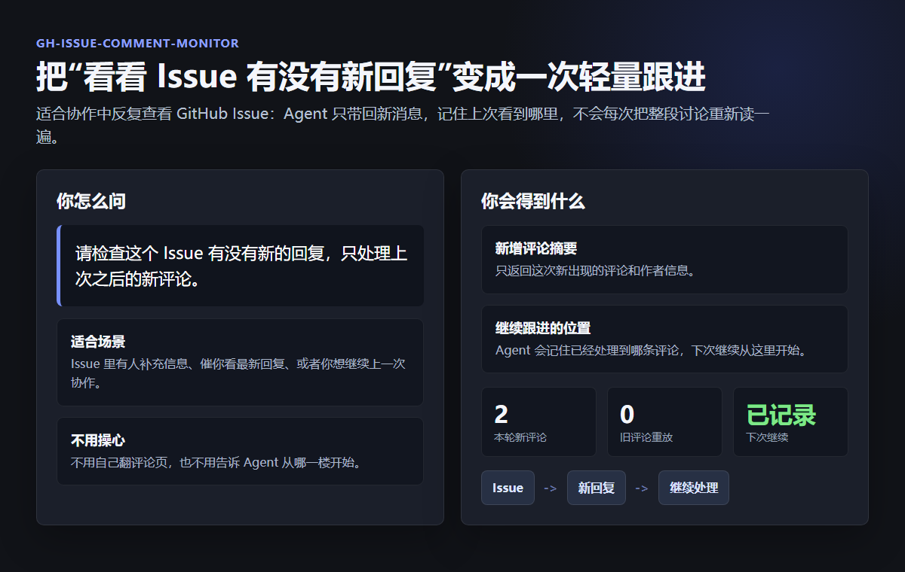

# 能力展示

这个 skill 解决的是一个很日常的问题：GitHub Issue 里来了一些新回复，你希望 Agent 只看新的内容，然后继续处理，不要每次都把整段讨论从头读一遍。



## 它适合做什么

- 跟进某个 GitHub Issue 有没有新评论。
- 只读取“上次之后”的新回复。
- 帮你把新回复里的要求、结论或阻塞点提炼出来。
- 下次继续查看时，自动从上次处理到的位置开始。

## 你会怎么用

你可以直接这样说：

```text
请检查这个 Issue 有没有新的回复，只处理上次之后的新评论。
```

或者：

```text
请读取这个 GitHub Issue 的最新 5 条评论，并在处理完成后记住进度。
```

## 你会得到什么

Agent 会给你一份轻量结果：

- 有没有新回复。
- 新回复是谁发的。
- 新回复大概说了什么。
- 是否需要你继续处理。
- 下次从哪里继续看。

## 一个真实展示

截图里的例子来自一次真实 Issue 跟进：本轮只处理了 2 条新评论，没有把旧讨论重新塞进上下文。对使用者来说，这个 skill 的价值就是省心：你只要说“再看看”，Agent 就知道该看哪里、该跳过哪里。
